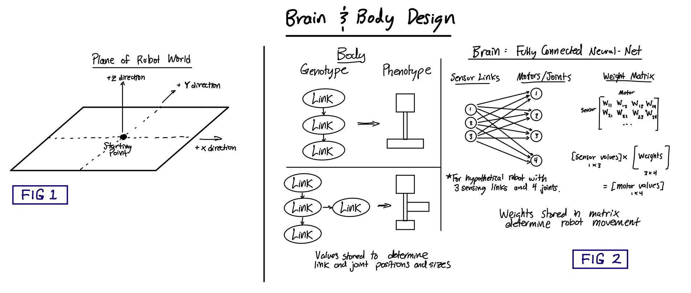
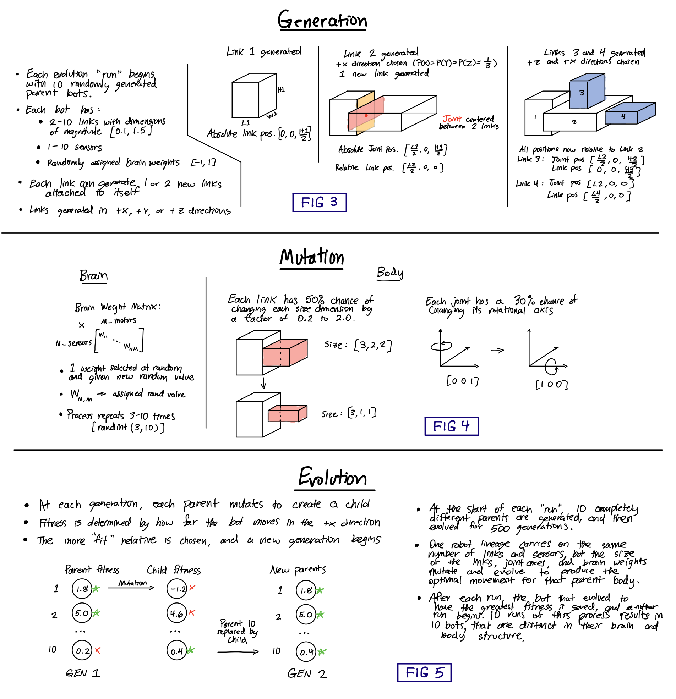
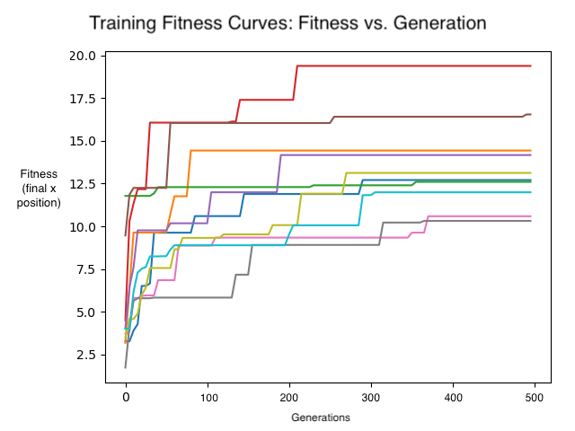

# COMP_SCI 396, Artificial Life: Final Project

# Run Instructions
After installing the needed dependencies...
To view 10 evolved robots: `python3 search.py -mode=load`
* Set constants.py STEPS=500 for shorter simulations.

To start new evolution: `python3 search.py -mode=evolve`
* Set constants.py PRINT=True to print bot fitnesses at each generation.

To reproduce results, run evolution with the current values in constants.py.

# Introduction

In this project, I generate random robots and evolve them over many generations to optimize their movement. The robots act in a simulated world (powered by Pyrosim), and they start off with a random body shape and brain function. Then, slight adjustments (mutations) are made to their brains and bodies over many generations, until robots have evolved more optimal forms and movement patterns.

# Methodology

## Body Generation
See Figures 2 and 3 for diagrams of body generation. Bodies are randomly generated with 3-11 links, and this happens once for each parent at the start of each "run". The link/joint sizes and positions are stored for the bot, and used at each new generation to create a body.urdf file for simulation. Links are generated one-by-one, and each new link is randomly placed on one of three open faces of the previous one facing in the positive x, y, or z direciton. The shape of each link is determined by assigning random values between 0.1 and 1.5 to each dimension of the rectangle. Each joint has 50% freedom of movement, and the joint axes are randomly assigned, which allows for a wide variety of movement. The body can fill up all of 3D space, as the path of generated links can randomly travel in any direction. Each link is stored as an object specified in link.py, and this object contains the information necessary for generating that link and the joint that connects it to the previous link.

The method I use to randomly place new links is described below:
1. 1 or 2 new directions are selected from +X, Y, and Z.
2. Given the current and previous directions of expansion, the relative position of the new joint and link are calculated based on a series of conditional statements. The new joint/link are centered on the chosen face of the previous link.
3. If the current and previous direction are along the same axis, for example both in the +x-direction, then the new joint position is expressed as [previous_link_size_x_direction, 0, 0]. The new link position is expressed as [new_link_size_x_direction/2, 0, 0]. When the current and previous directions are along different axes, then the new vector has values along those axes with magnitudes of previous_link_size\*0.5. This logic is performed by branch_in_dir(), lines 149-191.
4. Each generated link has a 50% chance of being a sensor link.

## Brain Generation

As the initial body is constructed, the name of each "sensing" link is stored. Once the body generation is complete, the brain is constructed based on the number of joints (and therefore motors) and the number of sensor links. To generate the brain, I iterate through these links and make a connection between each sensor and every motor neuron (see line 31 in solution.py). See Figure 2, "Fully Connected Nueral Net". So, a sensor on one end of the body can trigger a motor anywhere else on the body. Each weight in this matrix is initialized with a random value from [-1, 1]. Like the robot body, once the initial brain structure has been generated, these weights are stored in an instance of the Solution class and used at the start of each generation to create brain file with the same (parent) or mutated (child) weights.

## Simulation and Action
When it is time to simulate a body, I loop through each link object and access the necessary information to send the links and joints to the body.urdf file. Similarly, I loop through the brain weights to generate a matrix of size num_sensing_links x num_motors. The robot is spawned into the empty world (see Figure 1), and its movement is dictated by the outputs of the neural network based on the sensor inputs at each time step. The robots movement in the world is tracked, and I save the final x-coordinate of its position to use as a fitness metric. Gravity is set to -9.8, the max force is set to 80, and the simulation runs for 2000 steps.

## Robot Mutation and Evolution
The code runs 500,000 simulations to evolve the best robots for locomotion in the +X direction. See Figures 4 and 5 for insight into the evolution/selection/mutation process. The evolution is based on the idea of a "parallel hill climber", where different robots are evolve in parallel for many generations to optimize some behavior. At the start of each "run", 10 random robot morphologies (parents) are generated. Then, the 10 parent robots are mutated to generate 10 child bots, and for each parent/child pair, the one with the highest fitness is selected to "live on". This process is repeated for 1000 generations. "Fitness" is calculated by how much distance the robot moves in the +X direction over the course of the simulation.

At the start of each generation, a mutated child is created from the parent. Several features of the robot can mutate (see Figure 4): any of the neuron weights, the joint axes (about which axis each joint moves), and the size of the dimensions of each link. Each feature has a specified probability of mutating at any given generation. The Solution class's Mutatate() function is called to start the mutation process for a given robot. Within this function, some random number of brain weights are modified, either assigning the weight a completely new random value or multiplying the existing weight by a value between [0.8, 1.2]. Then, each link/joint pair undergoes individual mutations as specified in Link class. Here, each joint has a random chance of changing axes, and each link has a random chance of modifying its shape. If a link's shape is modified, then link.py's adjust() function is called on its child link(s) to correct the joint positions. I also have other checks in these mutation functions to ensure that a link's dimensions don't grow too small (<0.1) or too large (>2.0), and the brain weights stay in the range [-1,1].

# Results

Overall, running the evolutionary process as described above produced bots that could quickly move in the +X direction. The fitness curves below show 500 generations of evolution, and each line/color represents the performance of a different random seed. Many of the bots were able to evolve from relatively poor performance—moving only a few units in the X direction—to impressive performance, travelling nearly 20 units. The bots also achieved the greatest increase in performance during the first 200 generations, and afterwards, they tended to plateau.

I also included a video that shows simulations of the evolved bots. It's apparent from the video that some robots evolved superior bodies, while others honed in on their brain weights to achieve a smooth gait. The unevolved bots had clunky bodies and completely random movements, and many of the "winners" from early generations were simply robots that "fell over" in the +X direction and therefore had the highest fitness. However, after 500 generations, the bots evolved efficient and interesting bodies and movements. Some rested on the ground, scooting themselves forward. Others balanced on one link and hopped forward. 

From playing around with different parameters for the robots and their evolution, I came away with some insights. I achieved greater success from modifying more weights at once, rather than just 1 per generation. This way, even if a bot got stuck in an evolutionary rut—getting stuck in a sort of local performance maximum—there was still a chance that up to 10 of the weights could randomly change to cause an jump in performance. Additionally, modifying the weights by multiplying by some factor instead of just overwriting it allowed the brains to better "hone in" on the ideal weights for a more productive movement pattern, because it could evolve smaller adjustments. Next, choosing to only have multiple links branch from the previous link 50% of the time tends towards simpler and more compact bots that tended to perform better. The best bots tended to have more sensor neurals, especially that were located in places that make contact with the ground. They were "simpler" in design—it may be easier for the brain to learn to control a more simple and compact form, instead of one with many limbs that puts it off balance.

I also did a run with 1000 generations, but had technical difficulties that didn't allow me to save the fitness values for the plot. I show robots that evolved for 500 and for 1000 generations in the video.

## Future Work
There are some techniques I would like to experiment with in the future to achieve even better results. These include:
* Programatically modify all parameters and do a grid search: probabilities that determine number of links, likelihood of sensing links, likelihood of different types of mutation, min and max link size, number of simulation steps, etc.
* The majority of the performance depends on generating a good body in the first place, but it is computationally expensive to take thousands of parent bodies through 500 generations of evolution. I'd like to introduce pruning, where after every generation, the bottom 20% of bots are pruned, until you reach some number of parents (i.e. 20), and then continue evolving those for more generations.
* Limit the size of links, as many evolutionary designs were held back by links that were too large and slowed down the bot.

# Resources

This project is built on the "LudoBots" evolutionary robotics reddit course, which can be found here: https://www.reddit.com/r/ludobots/

I also use the pyrosim robot simulation library, found here: https://github.com/ccappelle/pyrosim
